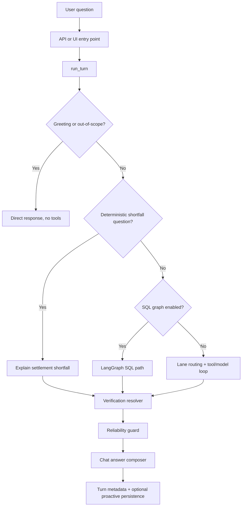

# Orchestration Layer Report

This report is historical context for the removed split-runtime design. The active ask flow is documented in [`UNIFIED_ASK_REBUILD.md`](/Users/madhavpatel/New_demo copy/docs/run_time_docs/UNIFIED_ASK_REBUILD.md).

## Purpose
The orchestration layer is the control plane that decides:
- whether a user message should be answered directly or routed into analysis
- which lane should handle it (`operations`, `growth`, or effectively `general` via auto-routing)
- whether a deterministic fast path should run before the model
- which tools the model is allowed to use
- how verification state is resolved
- how the final answer, evidence, and proactive side effects are produced

This report describes the current orchestration behavior in the live codebase and identifies the strongest refinement areas before broader expansion.

## Primary Files
- [`/Users/madhavpatel/New_demo copy/app/copilot/runtime.py`](/Users/madhavpatel/New_demo copy/app/copilot/runtime.py)
- [`/Users/madhavpatel/New_demo copy/app/copilot/toolcalling.py`](/Users/madhavpatel/New_demo copy/app/copilot/toolcalling.py)
- [`/Users/madhavpatel/New_demo copy/app/copilot/tools.py`](/Users/madhavpatel/New_demo copy/app/copilot/tools.py)
- [`/Users/madhavpatel/New_demo copy/app/api/server.py`](/Users/madhavpatel/New_demo copy/app/api/server.py)

## Entry Points
There are two main orchestration entry points:

1. `run_turn(...)` in [`runtime.py`](/Users/madhavpatel/New_demo copy/app/copilot/runtime.py)
- used by the merchant copilot runtime
- powers Streamlit and API chat flows
- handles lane routing, tool execution, deterministic fast paths, and final answer composition

2. `/api/v1/copilot/ask` in [`server.py`](/Users/madhavpatel/New_demo copy/app/api/server.py)
- the HTTP entry point for the React frontend
- validates request payloads and forwards them into `run_turn(...)`

## Current Control Flow
At a high level, a question flows like this:

## Routing Logic
### 1. Smalltalk short-circuit
`run_turn(...)` first checks whether the message is a pure greeting or thank-you.

Behavior:
- exact match only
- examples: `hi`, `hello`, `hey`, `thanks`, `thank you`
- if matched, the runtime returns a direct response and skips analysis

Strength:
- prevents greetings from becoming fake operations summaries

Weakness:
- exact-match only; it does not cover wider conversational phrasing

### 2. Out-of-scope short-circuit
If the question is unrelated to merchant operations/growth/payments, the runtime returns a short redirect instead of forcing a merchant answer.

Strength:
- avoids nonsense analysis on unrelated questions

Weakness:
- the classifier is still heuristic, not intent-model-based
- some edge cases will still slip through to the normal path

### 3. Lane routing
If no lane is forced by the UI/API, the runtime auto-routes the question using `_route_lanes(...)`.

Current behavior:
- `operations` for settlements, deductions, disputes, refunds, chargebacks, payout questions
- `growth` for success rate, failures, acceptance, routing, opportunities, terminals
- mixed asks can still route both lanes internally
- many simple asks now stay single-lane instead of always mixing operations + growth

Strength:
- better than the earlier always-run-both approach
- reduces latency and cross-lane noise

Weakness:
- still heuristic and keyword-driven
- no explicit neutral business-info lane; `general` is approximated through auto-routing and early shortcuts

## Deterministic Paths
### 1. Payout shortfall fast path
For operations questions that look like:
- `I expected X but got Y`
- `Explain the shortfall`
- payout mismatch phrasing

the runtime prefers a deterministic shortfall explainer before the model/tool loop.

This uses:
- [`/Users/madhavpatel/New_demo copy/app/copilot/tools.py`](/Users/madhavpatel/New_demo copy/app/copilot/tools.py)
- the settlement deduction fields in the DB

Strength:
- materially improves the demo-critical payout explanation path
- faster and more truthful than asking the model to infer causes from generic settlement listings

Weakness:
- still settlement-specific rather than merchant-summary-first
- broader reconciliation logic outside this path remains weaker

### 2. SQL LangGraph path
If `SQL_LANGGRAPH_ENABLED` is enabled, some analysis can bypass the standard tool loop and go through the LangGraph SQL analyst path.

Strength:
- offers a more controlled SQL reasoning path

Weakness:
- not the main active path for the current demo
- creates two orchestration modes the team must understand and maintain

## Tool-Driven Model Loop
If no deterministic fast path is selected, the runtime calls `invoke_with_tools(...)` in [`toolcalling.py`](/Users/madhavpatel/New_demo copy/app/copilot/toolcalling.py).

Current characteristics:
- tool use is iterative
- lane-specific allowlists restrict tool usage
- step budget is now smaller by default
- broader overview questions can trigger `startup_kpis` fallback

### Lane allowlists
The runtime uses explicit allowlists.

Operations currently emphasizes:
- settlements
- shortfall explanation
- chargebacks
- refunds
- cashflow
- KPI/failure verification
- action creation
- KB lookup

Growth currently emphasizes:
- KPI/failure verification
- terminal analytics
- terminal health/correlation
- credit fit
- KB lookup

Strength:
- keeps the model bounded to lane-relevant tools

Weakness:
- heuristic prompt/tool planning is still required inside each lane
- lane-tool mismatches still happen when model reasoning is not aligned with lane intent

## Verification and Reliability Guard
After evidence is collected, the runtime resolves a verification state:
- `VERIFIED`
- `UNVERIFIED_SUPPORTED`
- `INSUFFICIENT_EVIDENCE`

Then it applies a deterministic reliability guard to reduce unsupported certainty.

Strength:
- improves trust and prevents false “verified/top driver” claims
- keeps evidence IDs and verification status attached to answers

Weakness:
- still adds structural stiffness to some answers
- the internal section model is stronger than the user-facing narrative, which can create a mismatch between internal metadata and natural conversation

## Final Answer Composition
The current answer path is more conversational than earlier versions:
- direct answer first
- short verification/evidence footer after
- reduced report-style block formatting

Strength:
- much better than the earlier report-construction tone
- single-lane asks are cleaner

Weakness:
- the runtime still internally builds structured lane sections and then maps them into chat
- some answers remain overly diagnostic rather than operator-ready
- list-style questions still depend on tool rows and frontend rendering for the best structure

## Side Effects and Persistence
The orchestration layer has side effects beyond answering chat.

Current side effects include:
- proactive card persistence from runtime lanes
- evidence collection for the turn record
- action preview/action creation hooks when tools request them

Strength:
- allows chat, proactive inbox, and Action Center to converge on shared evidence objects

Weakness:
- side effects are still split across runtime-level proactive persistence and merchant-OS background refresh logic
- this means the system currently has two proactive generation paths:
  - runtime-driven
  - background refresh-driven

That split is functional, but not yet architecturally clean.

## Strengths of the Current Orchestration Layer
1. It has clear bounded entry points.
2. It now avoids obvious bad behavior for greetings and unrelated questions.
3. It has a deterministic fast path for the most important demo scenario.
4. It keeps lane-level tool access controlled.
5. It has explicit verification states and evidence handling.
6. It is significantly better on latency than the earlier fully mixed, multi-step path.

## Main Weaknesses
1. Routing is still heuristic-heavy.
- no learned or declarative intent layer
- behavior depends strongly on phrasing

2. There are still too many orchestration modes.
- direct smalltalk/out-of-scope path
- deterministic shortfall path
- normal tool/model loop
- optional SQL graph path
- background proactive path outside chat

3. The system still has split proactive orchestration.
- runtime creates some proactive cards
- merchant snapshot/background refresh creates others
- this is workable but not elegant

4. Internal structure is stronger than the conversational contract.
- the runtime still thinks in sections/states more than in “one clean response object”

5. The orchestration layer is still too coupled to current product semantics.
- operations/growth are good product lanes
- but some neutral merchant-information asks still need special handling rather than a cleaner general-info lane

## Immediate Refinement Recommendations
1. Create a single response envelope contract.
- one canonical turn object for:
  - answer
  - verification
  - evidence
  - optional cards/actions
- use that envelope everywhere instead of partially separate lane-section and UI-layer conventions

2. Consolidate proactive generation ownership.
- choose whether proactive cards are primarily:
  - runtime side effects
  - or background-monitor outputs
- keep one as canonical and the other as a thin consumer

3. Add a thin intent classifier layer.
- not a full agent
- just a cleaner intent type before lane/tool routing
- examples:
  - greeting
  - out_of_scope
  - business_identity
  - list_request
  - payout_shortfall
  - dispute_status
  - growth_opportunity

4. Narrow fallback bootstrapping even further.
- only run broad KPI bootstrap when the question is actually asking for an overview
- keep narrow asks narrow

5. Keep deterministic fast paths for high-trust workflows.
- payout shortfall
- verified failure drivers
- structured list views
- these should remain explicit rather than model-inferred

## Future Architectural Direction
The clean long-term shape is:
- intent layer
- evidence planner
- deterministic high-trust workers
- optional model reasoning for synthesis only
- one response envelope
- one proactive event pipeline

That would reduce the current “several partially overlapping orchestration styles” problem.

## Overall Assessment
The orchestration layer is now good enough for the internal demo path, especially for:
- growth Q&A
- terminal-scoped analysis
- payout shortfall explanation

It is not yet clean enough to be considered stable long-term platform architecture.

### Readiness
- Internal demo readiness: strong enough with targeted demo hardening
- Pilot readiness: acceptable with caution
- Long-term merchant OS readiness: not yet; the orchestration layer still needs consolidation
