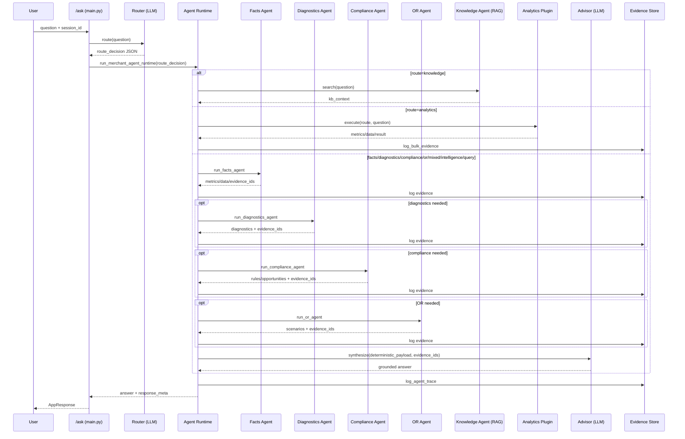

# Agent Runtime Spec (Phase 1)

## Purpose

This document defines the active `/ask` runtime architecture, routing policy, agent responsibilities, and response contracts for the Merchant Intelligence Copilot.

---

## 1) Runtime Overview

`/ask` executes a single orchestrated flow:

1. Router agent (LLM) classifies route and subtasks.
2. Runtime orchestrator executes deterministic agents based on router decision.
3. Agent-level reasoning (LLM) runs per invoked agent on deterministic payload.
4. Advisor agent (LLM) synthesizes grounded narrative from deterministic payload + agent reasoning.
5. Response is returned with traceable evidence IDs and grounding metadata.

No legacy graph-agent fallback is used in the active `/ask` path.

---

## 2) Sequence



---

## 3) Router Contract

Router prompt contract is defined in `app/prompts.py` (`ROUTER_DECISION_PROMPT`).

Expected normalized decision:

```json
{
  "route": "facts|diagnostics|compliance|or|mixed|knowledge|analytics|query|intelligence",
  "analysis_type": "string|none",
  "time_range": "natural language range",
  "compare_to": "optional range",
  "dimension": "optional dimension",
  "limit": 5,
  "subtasks": ["facts","diagnostics","compliance","or"],
  "required_fields": ["time_range","merchant_id","payment_mode","terminal_id","response_code","objective"],
  "confidence": 0.0,
  "clarify_question": "optional question"
}
```

Router is strict:

- If router LLM is unavailable or invalid JSON is produced, router raises error.
- `/ask` returns `router_error` without hardcoded route inference.

---

## 4) Clarification Policy

Runtime abstains and asks clarification when:

- `confidence < 0.70`, or
- `required_fields` is non-empty.

`required_fields` is router-authoritative (no keyword-marker inference from question text).

---

## 5) Agent Details

### 5.1 Facts Agent (`app/core/agents/facts_agent.py`)

- Resolves MID and effective window (clamped to available data range).
- Computes deterministic KPI bundle from `transaction_features`.
- Produces:
  - Core metrics (txns, success/fail, revenue, avg ticket, card-vs-upi delta)
  - Mode success stats
  - Top failure codes
- Logs evidence entries for metrics and top contributors.

### 5.2 Diagnostics Agent (`app/core/agents/diagnostics_agent.py`)

- Deterministic failure breakdowns:
  - mode × response_code
  - hour of day
  - terminal
- Abstains if no failed events in window.
- Logs evidence for top failure signatures.

### 5.3 Compliance Agent (`app/core/agents/compliance_agent.py`)

- Composes deterministic engines:
  - compliance rules engine
  - liability engine
  - tax/accounting engine
  - product eligibility engine
- Merges rule fires and opportunities.
- Logs evidence with `rule_id` + `rule_version`.

### 5.4 OR Agent (`app/core/agents/or_agent.py`)

- Evaluates registered OR models from registry.
- Active model (Phase 1): card success lift scenario (+1pp / +2pp).
- Logs scenario impact metrics as evidence.

### 5.5 Advisor Agent (`app/core/agents/advisor_agent.py`)

- LLM synthesis from deterministic payload only.
- Grounding guard:
  - Rejects unseen numbers/dates/entities.
  - One regenerate attempt.
  - Falls back to deterministic summary on violation.
- Appends `EVID:<id>` references when absent.

### 5.6 Knowledge Agent (`app/core/rag_agent.py`)

- Agentic RAG loop:
  - rewrite query
  - retrieve docs
  - grade relevance
  - format grounded context
- Used only when router selects `knowledge`.

### 5.7 Agent-Level Reasoners (`app/core/agents/agent_reasoners.py`)

- Dedicated reasoners for:
  - facts
  - diagnostics
  - compliance
  - or
  - analytics
- Each reasoner uses only deterministic payload + evidence IDs.
- Shared numeric/date grounding guard enforces that reasoner output cannot introduce unseen values.
- On guard failure, reasoner returns strict fallback note and advisor continues with deterministic payload.

---

## 6) Evidence and Trace Model

### 6.1 Evidence ID

`evid_<sha1(mid|source_type|source_ref|metric_name|window_start|window_end|rule_version)[:16]>`

### 6.2 Tables

- `evidence_log`
- `insight_cards`
- `agent_trace_log`

Tables are auto-created by `ensure_phase1_tables()`.

---

## 7) `/ask` Response Contract

`AppResponse.response_meta` fields:

```json
{
  "route": "analytics|knowledge|query|intelligence|mixed",
  "agents_invoked": ["router","facts","advisor"],
  "evidence_ids": ["evid_..."],
  "abstained": false,
  "clarification_question": null,
  "grounding_status": "strict_pass|strict_fallback",
  "confidence": 0.87,
  "response_type": "grounded_agent_response|clarification_required|knowledge_answer|error|router_error",
  "llm_used": true
}
```

---

## 8) Additional Endpoints

- `POST /action_center/cards`
  - Generates or fetches ranked proactive cards.
- `POST /evidence/lookup`
  - Resolves evidence records by ID or MID.
- `POST /scenario/run`
  - Returns baseline + OR scenario payload.
- `POST /copilot/clarify`
  - Returns clarify requirement from router decision.

---

## 9) Current Invariants

- Router decision is AI-generated JSON, then normalized.
- Deterministic agents generate metrics and evidence.
- Advisor can narrate; it cannot introduce non-evidenced numbers.
- Every non-trivial recommendation can be traced through `evidence_ids`.
- Active `/ask` path has no marker-based intent router and no legacy graph-agent fallback.
