# Bank Foundry Platform Map

## Purpose

This document translates the target "Foundry-style" platform picture into the
current Bank Foundry codebase.

It answers four practical questions:

1. what is already implemented
2. what is partially implemented
3. what is still future work
4. what phases remain before Bank Foundry is completee

## Status legend

- `Implemented`: active in the current product path
- `Partial`: real code exists, but the area is still limited or simulated
- `Future`: planned, not yet built into the live system

## Current platform map

```mermaid
flowchart TD
  subgraph Touchpoints["External Touchpoints"]
    MP["Merchant portal (Implemented)<br/>merchant workspace and chat"]
    BC["Bank console (Implemented)<br/>ops queue, case detail, approvals"]
    PI["Proactive jobs (Implemented)<br/>background signals and auto-intake"]
    EXT["External connectors (Partial)<br/>settlement connector seam only"]
    REG["Regulatory and monitoring feeds (Future)"]
  end

  subgraph Agents["AI Agents"]
    MCA["Merchant live agent (Implemented)<br/>merchant chat runtime"]
    GCA["Generic bank case copilot (Implemented)<br/>base MCP case summary"]
    SSA["Settlement specialist agents (Implemented)<br/>summary, note, approval draft"]
    SLA["Support lane agents (Future)"]
    RLA["Risk and AML agents (Future)"]
    IRA["Incident response agents (Future)"]
  end

  subgraph MCP["MCP Tool Groups"]
    CM["Case and workflow (Partial)<br/>case-aware summary and drafts"]
    PS["Payments and settlement (Implemented)<br/>settlement detail, cashflow, shortfall"]
    RM["Risk and compliance (Future)"]
    CC["Customer and merchant (Implemented)<br/>merchant profile, KPI context"]
    TO["Tech and ops (Partial)<br/>verified SQL only in bounded form"]
    DC["Drafting and comms (Partial)<br/>operator note and approval draft"]
  end

  subgraph Core["Bank Foundry Core Platform"]
    CP["Control plane (Implemented)<br/>canonical requests, routing, sessions"]
    ONT["Ontology (Implemented)<br/>shared business objects and runbooks"]
    WF["Workflow layer (Implemented)<br/>merchant and bank surfaces"]
    CASES["Case and approval core (Implemented)<br/>cases, tasks, approvals, timeline"]
    MEM["Case-scoped memory (Implemented)<br/>pinned settlement, window, evidence"]
    MCPB["Governed MCP boundary (Implemented)<br/>schemas, guards, tool registry"]
    CONN["Connector pipeline (Partial)<br/>simulated settlement dispatch"]
    OBS["Observability and evals (Partial)<br/>tests present, full ops evals not yet"]
  end

  subgraph Systems["Connected Systems"]
    MDB["Merchant and payments DB (Implemented)"]
    CB["Core banking systems (Future)"]
    PR["Payment rails (Future)"]
    RS["Risk systems (Future)"]
    AML["Regulatory and AML systems (Future)"]
    ITSM["ITSM and monitoring systems (Future)"]
  end

  MP --> MCA
  BC --> GCA
  BC --> SSA
  PI --> CASES
  EXT --> CONN

  MCA --> WF
  GCA --> MCPB
  SSA --> MCPB

  MCPB --> CM
  MCPB --> PS
  MCPB --> CC
  MCPB --> TO
  SSA --> DC

  WF --> CP
  WF --> CASES
  WF --> MEM
  CASES --> ONT
  MCPB --> ONT
  CM --> CASES
  PS --> MDB
  CC --> MDB
  TO --> MDB
  CONN --> CB
  CONN --> PR
```

## How this maps to the code

### Implemented now

- Merchant live agent
  - `app/agent/service.py`
- Bank case copilot and settlement specialist agents
  - `app/agent/mcp_client.py`
  - `app/agent/bank_ops_agents.py`
- Control plane and canonical request model
  - `app/application/control_plane/router.py`
  - `app/application/control_plane/sessions.py`
  - `app/application/kernel/request_models.py`
  - `app/application/kernel/response_models.py`
- Merchant and bank workflow split
  - `app/application/workflows/merchant_surface.py`
  - `app/application/workflows/bank_surface.py`
  - `app/application/workflows/ops_console.py`
- Case, task, approval, timeline, and memory store
  - `app/data/ops/repository.py`
- Governed MCP boundary
  - `app/mcp_server/server.py`
  - `app/mcp_server/tool_registry.py`
  - `app/mcp_server/guards.py`
  - `app/mcp_server/schemas.py`
- Separate merchant and bank UI shells
  - `frontend/src/components/MerchantWorkspaceShell.jsx`
  - `frontend/src/components/BankOperationsShell.jsx`
  - `frontend/src/components/OpsConsoleView.jsx`

### Partial now

- Connector execution
  - `app/data/connectors/settlement_ops.py`
  - real seam exists, but it is still simulated
- Case-native drafting
  - settlement note draft and approval draft are live
  - broader drafting/comms coverage is not done yet
- Observability and evals
  - focused regression suites exist
  - full ops replay-eval and release gates are not finished yet
- Tech and ops MCP coverage
  - `run_verified_sql` exists
  - broader operational MCP groups are not yet built

### Future

- Support lane agents
- Risk and AML agents
- Incident response agents
- Real core-banking and payment-rail integrations
- Regulatory data feeds
- ITSM and monitoring integrations
- Role-deep multi-lane workflows beyond settlement-first operations

## What Bank Foundry already is

Today Bank Foundry is already:

- a merchant workspace
- a merchant-facing data-grounded copilot
- a bank-facing ops console
- an internal case/task/approval system
- a settlement-first bank workflow
- a governed MCP capability boundary for bank-side agents

That means the system is no longer just a chat app.

It is already the beginning of an operating platform.

## What it is not yet

It is not yet:

- a full multi-lane bank operating system
- a real write-back platform into core banking
- an AML / risk / incident platform
- a fully evaluated and release-gated agent platform across all workflows

## Remaining phases to full Bank Foundry

### Phase H: Operator-controlled case memory

Goal:
- allow operators to explicitly pin and edit settlement, window, and evidence

Why:
- today memory is persisted automatically from copilot output
- operators still need direct control

### Phase I: Real settlement connector

Goal:
- replace simulated connector execution with a real external provider contract

Why:
- approval should lead to real downstream action, not only an internal receipt

### Phase J: Queue and SLA hardening

Goal:
- make the bank console a daily operator surface

Add:
- stronger aging
- SLA escalation
- blocked-state rules
- duplicate suppression
- related-case linking

### Phase K: Richer case copilot actions

Goal:
- move from summary-only copilot to workflow-driving copilot

Add:
- better escalation drafting
- case note refinement
- evidence curation
- action recommendation by lane

### Phase L: Support lane

Goal:
- run merchant support on the same case/task/approval core

Add:
- support-specific runbooks
- support MCP tools
- support queue views

### Phase M: Risk lane

Goal:
- add risk and compliance workflows on the same platform

Add:
- risk playbooks
- screening / compliance integrations
- risk-specific agent visibility and approvals

### Phase N: Replay evals and release gates

Goal:
- protect the platform as the agent surface grows

Add:
- seeded ops benchmark cases
- evidence-quality checks
- approval enforcement checks
- connector execution validation

### Phase O: Full cross-surface object model

Goal:
- make merchant findings, proactive signals, cases, approvals, and connector runs
  all part of the same shared object system

Why:
- this is when Bank Foundry becomes a true control plane, not a set of linked
  screens

## Practical readiness definition

Bank Foundry is ready for the "full version" when all of these are true:

- merchant and bank surfaces share one control plane and object model
- bank teams can work daily from queues, cases, approvals, and connector-backed actions
- settlement ops is fully operational with real downstream execution
- support and risk lanes are active on the same platform
- MCP is the governed capability boundary for bank-side agents
- case memory, evidence, approvals, and connector runs are durable and auditable
- replay evals and release gates protect both merchant and bank workflows

## Real issues vs noise

Real product gaps:

- connector execution is still simulated
- multi-lane agent coverage is still narrow
- operator memory is not yet directly editable
- full ops replay evals are not in place yet

Usually not product issues:

- Starlette `python_multipart` warning in tests
- Vite chunk-size warning during frontend build
