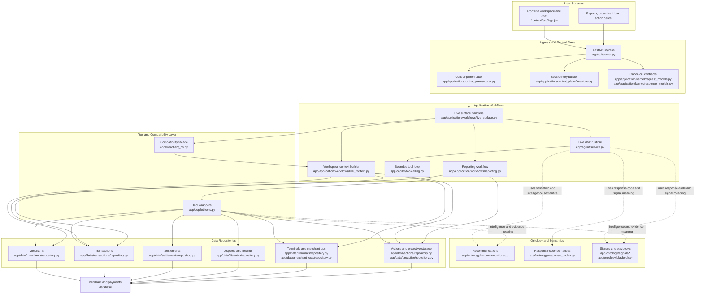

# Live Architecture Diagram

## Purpose

This diagram explains the **current live architecture** after the control-plane,
workflow, data-layer, and ontology cleanup work.

It is intentionally focused on the live path, not the future runtime.

## Diagram

## How to read this

The live system now has four practical layers:

1. **Ingress and control plane**
   - `app/api/server.py` accepts requests
   - requests are normalized into canonical models
   - session keys and routing are decided before execution

2. **Application workflows**
   - `live_surface.py` handles the live product behaviors
   - `live_context.py` builds merchant workspace context
   - `reporting.py` builds report payloads
   - `app/agent/service.py` handles the live chat turn

3. **Tool and compatibility layer**
   - `app/copilot/tools.py` is now mostly a thin wrapper layer
   - `app/merchant_os.py` still exists as a compatibility facade for the live path

4. **Ontology and data**
   - `app/ontology/*` owns business meaning, signals, and recommendation semantics
   - `app/data/*` owns raw reads and writes against the database

## What is better now

Before this cleanup, too much logic lived in:

- `app/api/server.py`
- `app/merchant_os.py`
- `app/copilot/tools.py`

Now the live path is much clearer:

- API and routing live at the top
- workflows sit in the middle
- tools are thin wrappers
- data access lives in repositories
- business semantics live in ontology modules

## What is still true

This is still the **live demo architecture**, not the future graph runtime.

That means:

- the live chat path still runs through `app/agent/service.py`
- the future revenue-recovery runtime is still separate
- `app/merchant_os.py` still exists as a transition layer

## Real issues vs noise

Real issue:

- if new feature work adds fresh SQL directly back into `server.py`,
  `merchant_os.py`, or `tools.py`, the layer split will drift again

Usually not a product issue:

- the Starlette `python_multipart` warning seen in tests is still framework
  noise
