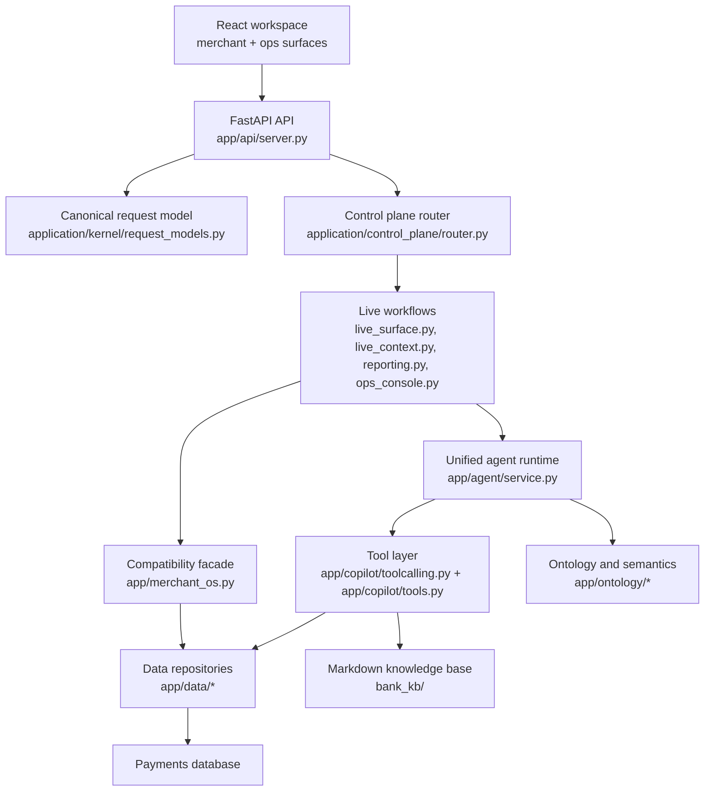

# AcquiGuru Project Overview, Architecture, and Functional Spec

## 1. Purpose of this document

This document explains the current AcquiGuru project in plain language.

It combines four views in one place:

- project scope
- product and delivery approach
- live system architecture
- selected elements of a functional specification document (FSD)

It is based on the active code paths in this repository, not only on target-state design notes.

## 2. Project summary

AcquiGuru is a merchant payments intelligence and operations workspace.

Its main job is to help a merchant or internal operator answer questions such as:

- What happened to my money?
- Why did success rate drop?
- Which settlements are delayed or short?
- What chargebacks, refunds, or payout risks need action?
- Which proactive growth or operations opportunities should be surfaced next?

The product combines:

- a merchant-facing React workspace
- a FastAPI backend
- a control-plane style request model
- a tool-driven AI assistant for grounded answers
- data repositories for payments, terminals, disputes, settlements, actions, and ops cases
- proactive monitoring and internal ops workflows

## 3. Current product scope

### 3.1 In scope in the live application

The active frontend exposes the following live surfaces:

- Chat
- Proactive Inbox
- Action Center
- Home
- Money
- Disputes
- Terminals
- Connected Systems
- Reports
- Ops Console

These features are wired through the active backend in `app/api/server.py` and the workflows under `app/application/workflows/`.

### 3.2 Core business problems addressed

The current project is designed to solve these practical merchant and operator problems:

- merchant visibility into transaction attempts, failures, and success GMV
- payout and settlement clarity, including pending and past-expected amounts
- operational handling of chargebacks and refunds
- terminal-level performance and health review
- proactive identification of risks and growth opportunities
- conversion of findings into actions or ops cases
- simple report-pack generation for sharing or export

### 3.3 Active user roles

The live code supports two main surfaces:

- merchant workspace users
- internal ops users working in lane-based queues

The ops flow is role-aware and lane-aware, with access patterns for:

- operations
- support
- risk

### 3.4 Transitional or partial areas

Some parts of the repository are clearly transitional:

- `legacy/` contains the older Streamlit surface
- `archive/` contains older or experimental implementations
- `future/` contains separate future-track work such as revenue recovery
- `app/merchant_os.py` is still used as a compatibility facade in the live path

This means the project is already functional, but still being reshaped into a cleaner application architecture.

## 4. Product approach

### 4.1 Product philosophy

The repo's UX and architecture documents show a consistent product idea:

- show verified facts first
- separate operations from growth
- keep explanations plain-language and merchant-friendly
- use AI to interpret data, but do not invent metrics or evidence
- turn insights into actions, cases, and reports

### 4.2 Delivery approach in the codebase

The live implementation follows a practical layered approach instead of a full rewrite:

1. Keep the product working end to end.
2. Normalize requests into a canonical format.
3. Route requests through workflows instead of embedding behavior directly in API handlers.
4. Keep raw data access in repositories.
5. Keep business semantics in ontology modules.
6. Use the AI layer mainly for orchestration, explanation, and evidence-grounded response composition.

### 4.3 AI approach

The active ask flow is tool-based, not free-form chat.

The backend is designed so that the assistant should:

- use tools before making merchant-specific claims
- use merchant and optional terminal scope
- return evidence-aware responses
- provide structured answer sections when possible
- avoid exposing internal SQL or implementation mechanics to the end user

In the current live path, the unified agent uses LangChain plus Ollama-based chat models through `app/agent/service.py`. Configuration also includes broader experimentation toggles, but the current primary chat runtime is the unified agent path.

## 5. Technology stack

### 5.1 Frontend

- React 19
- Vite 7
- Recharts for visual summaries
- plain React component architecture in `frontend/src/components/`

### 5.2 Backend

- Python
- FastAPI
- Pydantic request and response contracts
- SQLAlchemy for database access
- LangChain and `langchain_ollama`

### 5.3 Data and content

- default relational source is Postgres via `DATABASE_URL`
- default query source table is `transaction_features`
- bank and payments knowledge content is stored as Markdown in `bank_kb/`

### 5.4 Testing

The repository includes a substantial Python test suite under `tests/`, covering API behavior, repositories, control-plane phases, merchant OS behavior, MCP tooling, and unified agent behavior.

## 6. Live architecture overview

### 6.1 High-level view

### 6.2 Architectural layers

#### Frontend layer

The React app in `frontend/src/App.jsx` acts as the main shell. It switches between:

- merchant mode
- ops mode

The frontend calls REST endpoints through `frontend/src/api.js` and renders domain-specific views such as Money, Disputes, Reports, and Ops Console.

#### API and ingress layer

`app/api/server.py` is the live HTTP boundary. It defines endpoints for:

- merchant options and snapshots
- reports
- chat ask
- proactive inbox flows
- merchant action preview and confirm flows
- ops queue and case workflows
- dashboard analytics

This file also converts incoming requests into canonical request structures before handing them to workflows.

#### Control plane and request normalization

The control-plane pieces under `app/application/control_plane/` and `app/application/kernel/` establish a consistent execution model.

Important concepts include:

- `CanonicalRequest`
- `RequestType`
- `Surface`
- session keys based on merchant and terminal scope

This is important because the same backend now serves multiple surfaces with one core request model.

#### Workflow layer

The main workflow modules are:

- `live_surface.py` for merchant-facing surface requests
- `live_context.py` for merchant snapshot and context assembly
- `reporting.py` for report packs and brief generation
- `ops_console.py` for lane-based internal case handling

This layer turns raw repositories and AI outputs into frontend-ready payloads.

#### Agent and tool orchestration layer

The ask flow centers on:

- `app/agent/service.py`
- `app/copilot/toolcalling.py`
- `app/copilot/tools.py`

This layer decides whether a question needs tools, executes bounded tool steps, and composes a final answer using available evidence.

#### Data layer

The data layer is organized by domain:

- merchants
- transactions
- settlements
- disputes
- terminals
- merchant ops
- proactive storage
- actions
- ops repository

This is one of the strongest structural qualities of the current codebase because many domain reads and writes have already been moved out of the API surface.

#### Ontology layer

The ontology layer gives the project business meaning instead of raw database meaning.

Examples include:

- recommendations
- response-code semantics
- ops runbooks and case typing

This allows the application to describe business situations such as settlement shortfalls, payout delays, or runbook steps in a consistent way.

## 7. Major functional modules

### 7.1 Merchant workspace

The merchant workspace is the main product shell for payment transparency.

Key visible modules:

- Home: summary KPIs, payment mode KPIs, failure drivers, growth queue, proactive snapshot
- Money: pending amount, settled amount, settlement timing, settlement tasks
- Disputes: chargebacks, refunds, and dispute-related tasks
- Terminals: terminal performance and health
- Connected Systems: data coverage, integrations, operating signals
- Reports: downloadable report packs and briefs

### 7.2 AI chat assistant

The chat module lets a user ask natural-language questions about:

- settlements
- payouts
- failures
- refunds
- chargebacks
- terminal performance
- growth opportunities

The intended behavior is evidence-first. Answers may include:

- executive summary
- key findings
- next best action
- caveats
- structured result tables
- follow-up suggestions

### 7.3 Proactive inbox

The proactive module runs background refresh logic and surfaces cards such as:

- settlement delay
- chargeback deadline
- refund rate spike
- success rate drop
- terminal anomaly
- high-value failed transaction patterns

Cards can be acknowledged, dismissed, converted, or promoted into ops cases.

### 7.4 Action center

The action center persists merchant actions and supports:

- previewing an action
- confirming action creation
- changing status
- adding notes, owners, blocked reasons, and follow-up dates
- hiding duplicate or legacy queue items

### 7.5 Ops console

The ops console is an internal case-management lane.

It supports:

- queue listing
- manual case creation
- promotion from proactive cards, merchant actions, or chat findings
- case assignment
- notes
- approval requests
- resolution
- runbook progress display

This is a meaningful extension beyond a simple merchant chatbot because it turns intelligence into operational workflow.

### 7.6 Reporting

The reporting workflow produces:

- finance pack
- operations pack
- growth pack

Each pack can expose:

- summary lines
- datasets
- downloadable CSV outputs
- text email brief
- HTML print brief

## 8. Data and domain model summary

The project appears to use a merchant-centered domain model with optional terminal scoping.

Important business entities include:

- merchant
- terminal
- transaction
- settlement
- refund
- chargeback
- proactive card
- merchant action
- ops case
- approval request
- runbook step
- evidence reference

Important scoping concepts include:

- merchant-level workspace
- terminal-level workspace
- lane-specific ops context
- date-windowed data views

## 9. FSD elements

This section is not a full formal FSD, but it captures the most useful functional-spec elements for the current product.

### 9.1 Business objective

Build a merchant payments operations workspace that can:

- explain transaction and payout performance
- surface risks and opportunities proactively
- support merchant self-service and operator workflows
- convert findings into trackable actions and cases

### 9.2 Primary actors

#### Actor A: Merchant user

Needs:

- quick understanding of money movement
- failure reasons in plain language
- next best actions without technical noise
- reports and exports

#### Actor B: Internal acquiring ops user

Needs:

- structured queue of operational issues
- evidence-backed cases
- approval and resolution workflow
- runbook-guided execution

#### Actor C: Admin or system owner

Needs:

- configurable runtime
- safe architecture boundaries
- evidence-grounded AI behavior
- maintainable separation between data, workflow, and semantic logic

### 9.3 Core use cases

#### UC-1: Ask a grounded payments question

Trigger:

- user submits a question in chat

Expected behavior:

- system resolves merchant and optional terminal scope
- system uses tools if merchant-specific facts are needed
- system returns a plain-language answer with evidence-backed output
- system may suggest follow-ups or structured tables

#### UC-2: Review merchant workspace snapshot

Trigger:

- user opens Home, Money, Disputes, Terminals, or Connected Systems

Expected behavior:

- system returns a live snapshot for the merchant
- optional terminal scope narrows applicable data
- user sees KPIs, tables, and tasks relevant to the selected surface

#### UC-3: Refresh and act on proactive signals

Trigger:

- user opens Proactive Inbox or manually refreshes it

Expected behavior:

- system checks whether background refresh is due
- system returns active proactive cards
- user can acknowledge, dismiss, preview action, confirm action, or promote to ops

#### UC-4: Create or update merchant actions

Trigger:

- user previews and confirms a suggested action

Expected behavior:

- system generates an action preview
- system persists a merchant action after confirmation
- action can later be updated with owner, notes, status, or follow-up date

#### UC-5: Operate an internal case queue

Trigger:

- internal user opens ops console

Expected behavior:

- system returns lane-specific queue summary and cases
- user can create or promote cases
- user can assign, note, request approval, and resolve
- system exposes runbook steps and approval state

#### UC-6: Generate a report pack

Trigger:

- user opens Reports

Expected behavior:

- system builds report packs from the current snapshot
- user can download CSV datasets and briefing outputs

### 9.4 Functional requirements

#### FR-1 Scope management

The system shall support merchant-level scope and optional terminal-level scope across snapshot, chat, and report flows.

#### FR-2 Canonical request handling

The system shall normalize surface requests into a canonical backend request model before execution.

#### FR-3 Evidence-grounded chat

The system shall use tools before making merchant-specific claims about payments, settlements, disputes, refunds, or terminal performance.

#### FR-4 Proactive signal lifecycle

The system shall support proactive card refresh, listing, state update, action preview, and confirmation.

#### FR-5 Action persistence

The system shall persist merchant actions and allow status and detail updates.

#### FR-6 Ops workflow management

The system shall support queue listing, case creation, case promotion, assignment, notes, approvals, and resolution for internal ops users.

#### FR-7 Reporting outputs

The system shall generate report packs and brief outputs from merchant snapshots.

#### FR-8 Explainable outputs

The system shall present plain-language business outputs without leaking internal SQL or implementation details to end users.

### 9.5 Non-functional requirements

#### NFR-1 Maintainability

The codebase should keep a clean separation between:

- data access
- ontology and business semantics
- application workflows
- API delivery

#### NFR-2 Grounding and trust

Merchant-specific claims should be supported by deterministic tool outputs or clearly caveated language.

#### NFR-3 Extensibility

The system should support adding new surfaces, new request types, and new tools without rewriting the whole execution model.

#### NFR-4 Role safety

Ops lanes should honor role-to-lane access rules.

#### NFR-5 Testability

Core workflows, repository behavior, and API contracts should remain covered by automated tests.

## 10. Key integrations and dependencies

The current project depends on the following runtime inputs:

- a relational payments database
- local or configured LLM access, currently Ollama on the live unified path
- merchant and payments knowledge files in `bank_kb/`
- frontend environment variable `VITE_API_BASE`
- backend environment values from `config.py`

Important configuration areas include:

- database connectivity
- CORS
- query source table
- proactive refresh cadence
- tool and chat reasoning settings
- experiment toggles

## 11. Known boundaries and design realities

### 11.1 What the system is

It is best understood as:

- a merchant intelligence workspace
- a payments operations surface
- an evidence-aware AI assistant
- a lightweight internal case-management layer

### 11.2 What the system is not

Based on the current active code, it is not yet:

- a full ERP replacement
- a full settings and admin console
- a finalized target architecture with all transitional layers removed
- a pure microservice platform

### 11.3 Important live-vs-target distinction

The repo includes a target architecture direction in the control-plane and layered-architecture docs, but the live product still relies on some transitional compatibility paths, especially `app/merchant_os.py`.

That is normal for the current stage of the project and should be documented clearly so future contributors do not confuse target-state diagrams with already-completed refactoring.

## 12. Suggested acceptance criteria for the current project

The project can be considered functionally healthy if the following hold true:

- a merchant can load a snapshot and navigate all merchant views without backend contract errors
- chat answers stay scoped to the selected merchant and optional terminal
- proactive cards can be refreshed and acted on
- actions can be previewed, created, and updated
- ops users can create, promote, assign, approve, and resolve cases
- reports can be generated and downloaded from current snapshot data
- repository and API tests continue to pass

## 13. How to verify this document against the codebase

Use these files as the primary reference points:

- `frontend/src/App.jsx`
- `frontend/src/api.js`
- `app/api/server.py`
- `app/application/control_plane/router.py`
- `app/application/kernel/request_models.py`
- `app/application/workflows/live_surface.py`
- `app/application/workflows/reporting.py`
- `app/application/workflows/ops_console.py`
- `app/agent/service.py`
- `app/merchant_os.py`
- `app/data/`
- `app/ontology/`

Supporting architecture notes already present in the repo:

- `docs/LIVE_ARCHITECTURE_DIAGRAM.md`
- `docs/LAYERED_ARCHITECTURE_MAP.md`
- `docs/CONTROL_PLANE_TARGET_ARCHITECTURE.md`
- `docs/MERCHANT_OS_UX_SPEC.md`

## 14. Practical takeaway

AcquiGuru is already more than a demo chatbot.

In its live form, it is a payment intelligence workspace that connects:

- merchant-facing analytics
- evidence-grounded AI explanations
- proactive issue detection
- action generation
- internal ops case handling
- lightweight reporting

The main engineering theme of the current codebase is not feature invention, but disciplined consolidation: keep the product working while steadily moving toward a cleaner control-plane and layered architecture.
